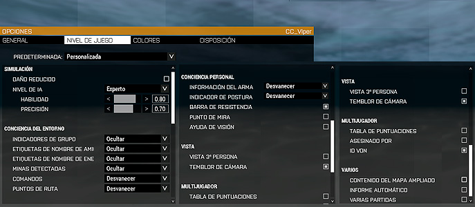

# Opcions de dificultat

Aquesta es la configuració de dificultat que fem servir al grup. Es especialment important que el servidor ho tingui configurat així, ja que son els seus paràmetres els que s'apliquen a tothom.

Heu de posar l'opció predeterminada `Personalitzada` i llavors marcar les opcions com veieu a l'imatge

{: .center}

Si vols saber que fa cada cosa, ho pots consultar en [aquest enllaç](http://community.bistudio.com/wiki/Arma_3_Difficulty_Menu).