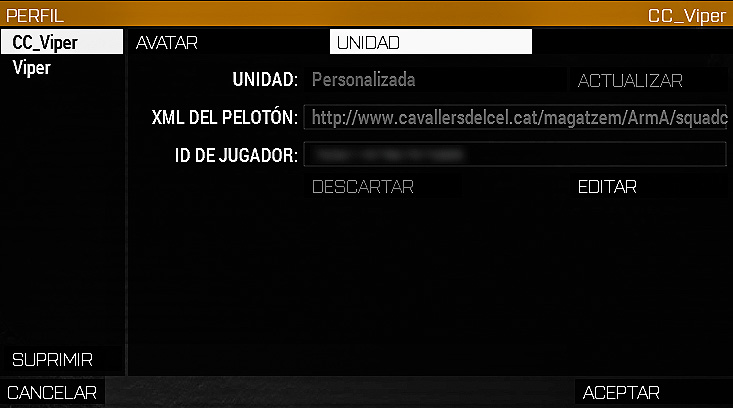

# Squad XML

L’Squad XML serveix per identificar-nos dins de l'Arma com a Cavallers del Cel i és obligatori portar-ho. Cal que el nostre nick tingui el TAG CC davant amb un guió baix `Ex: CC_Viper`.

L'adreça del Squad és, tot en minúscules.
`http://www.cavallersdelcel.cat/magatzem/ArmA/squadcc/cc_elvostrenick.xml`

Fixa't que al final de l'adreça, on posa cc_elvostrenick.xml, **ho has de canviar pel teu nick, en minúscules** `Ex: cc_viper.xml`.

En el menú principal del simulador, aneu al botó de perfil que hi ha a dalt a la
dreta (és la icona d’un cap), seleccioneu el vostre perfil (que ha de tenir el TAG
CC_ davant del nick, com a la imatge), aneu a la pestanya `Unitat`, i li doneu a
`Editar`. On posa `SQUAD XML` o `XML DE L'ESQUADRA` enganxeu l'adreça copiada.

{: .center}