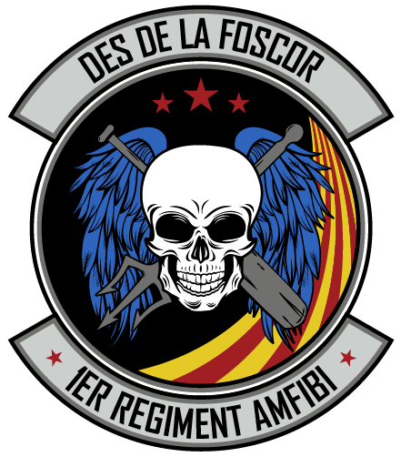

# **Sobre el 1er Regiment Amfibi**

{: .center}

El **1er Regiment Ambfibi** és un dels grups que pertany a la comunitat Catalana de simulació **Cavallers del Cel**. Dintre del **1RA** és realitzen missions de combat posant en practica tàctiques i estratègies reals en entorns altament hostils i amb un component de rol important per ajudar-nos a la immersió.

Per aconseguir completar les missions amb èxit, tenim un programa de reclutes on impartim classes de manera regular per formar als nous membres en una acadèmia virtual creada al simulador.

Si voleu contactar amb nosaltres ho podeu fer:

  - Al nostre web [cavallersdelcel.cat](http://www.cavallersdelcel.cat)
  - Al [fòrum del grup 1RA](http://www.cavallersdelcel.cat/forums/forums/arma-2-3.26)
  - Al nostre servidor de [Discord](https://discord.gg/4RGJdTv)